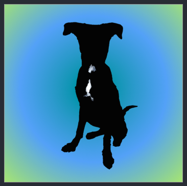

<!-- Twitter icon from https://github.com/carlsednaoui/gitsocial -->
[1.1]: http://i.imgur.com/tXSoThF.png (twitter icon with padding)
## Who am I, What am I

#### _Epicodus Code Review_
UI Week 4: Self-Improvement

### Dawn Mott :sunrise_over_mountains:
_June 15th, 2018_

### Description
A day spent working towards future career goals.

### Self-Assessment
I generally feel as though I could use a JavaScript refresher. I'd also like to spend some more time with Angular and TypeScript.

I'd like to meet more people in the industry and speak to them about their positions. I don't have a specific idea of what I'd like to do after school. I know that I'm looking for an office that is a nice culture fit. I would also like the ability to work part time from home.

### Plan
- Self-study
- Contact new mentors
- Setup meetings with new/old mentors
- Setup coaching appointments with my mentees
- Volunteer more in the community

### Work
- set up git repository
- create project folder
- add readme and begin filling in
- add self-assessment to readme
- add plan to readme
- add work to readme
- Refreshers  
  - [Some](https://youtu.be/KH57lIgwe2g) [Net](https://youtu.be/Az5J_EkhYCY) [Ninja](https://youtu.be/eZBTLsv2ktM) [Tutorials](https://youtu.be/uq7omoxwA7A)
  - [Articles on](https://scotch.io/tutorials/using-sass-with-the-angular-cli) [compiling Sass](https://medium.com/@brianhan/watch-compile-your-sass-with-npm-9ba2b878415b)
  - [Articles on importing Sass into Angular](https://scotch.io/tutorials/using-sass-with-the-angular-cli)
- Update resume
- Reach out to new contacts on linkedin  
- begin portfolio in Angular
  - create Mustard favicon  
  - add images to portfolio site
  - mobile Sketch layout
   

### Setup/Installation Requirements
* Read the readme

### Known Bugs

_There are many known :bug: at this time, this is a work in progress_

### Support and contact details

_If you'd like to chat, please contact_ @dawnrparty _on_ ![alt text][1.1]

### Technologies Used
markdown

<!-- 

 -->

### License

*This page is licensed under the MIT license*

&copy; 2018 Dawn Mott :sunrise_over_mountains:
